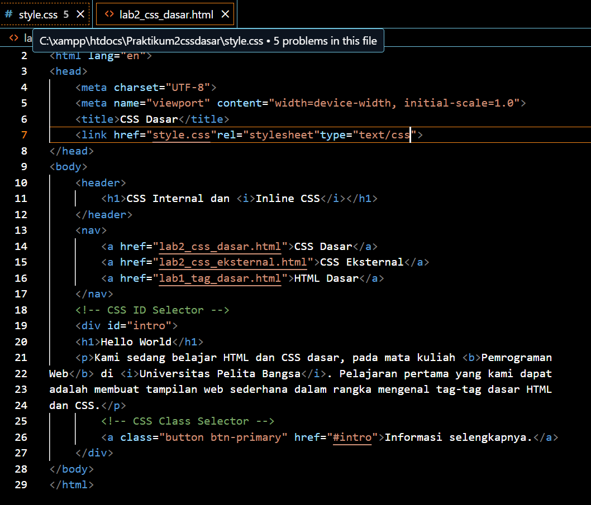
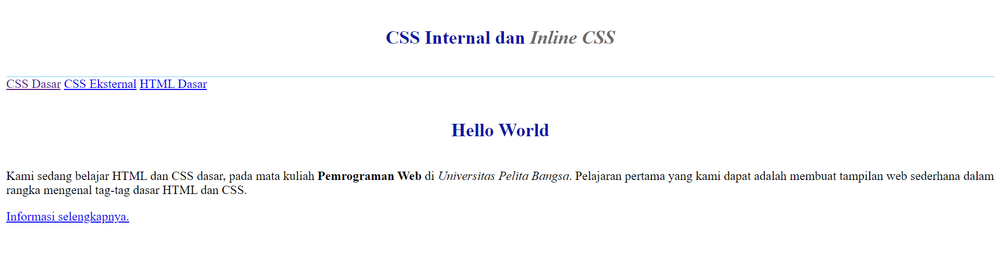
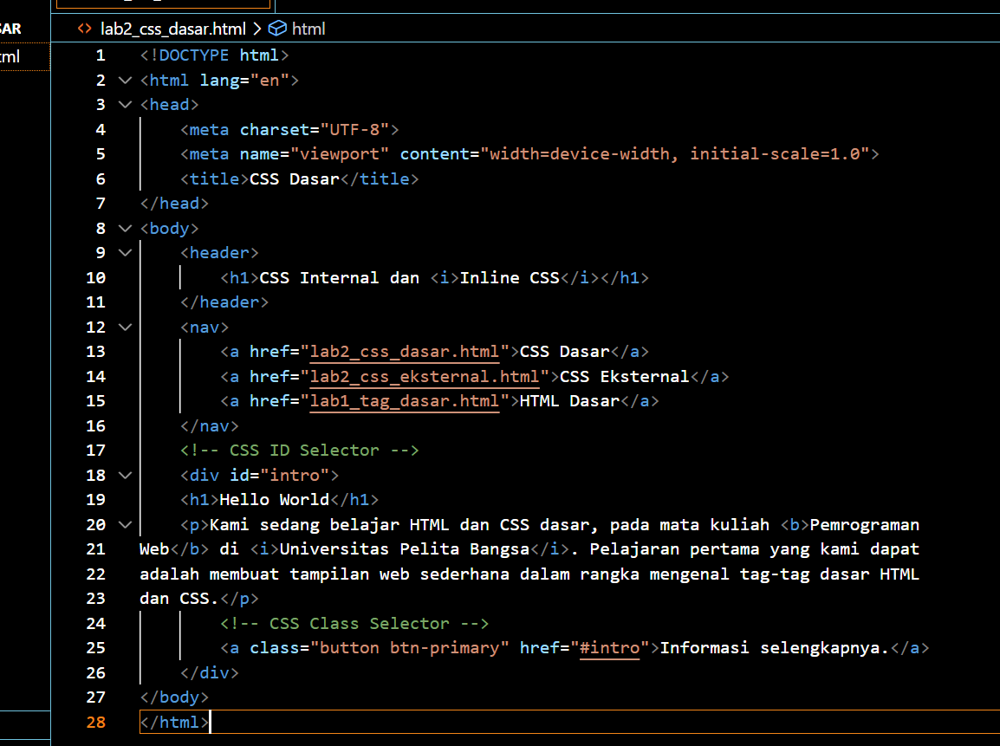
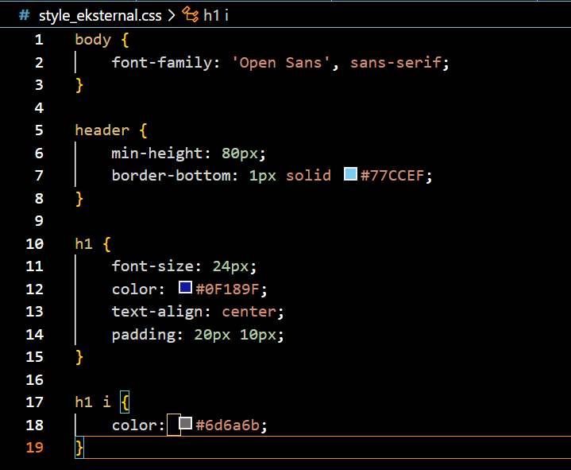
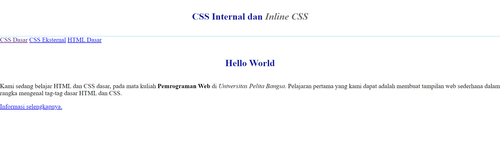
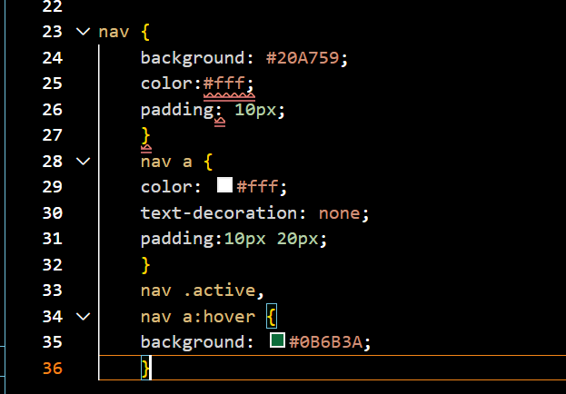
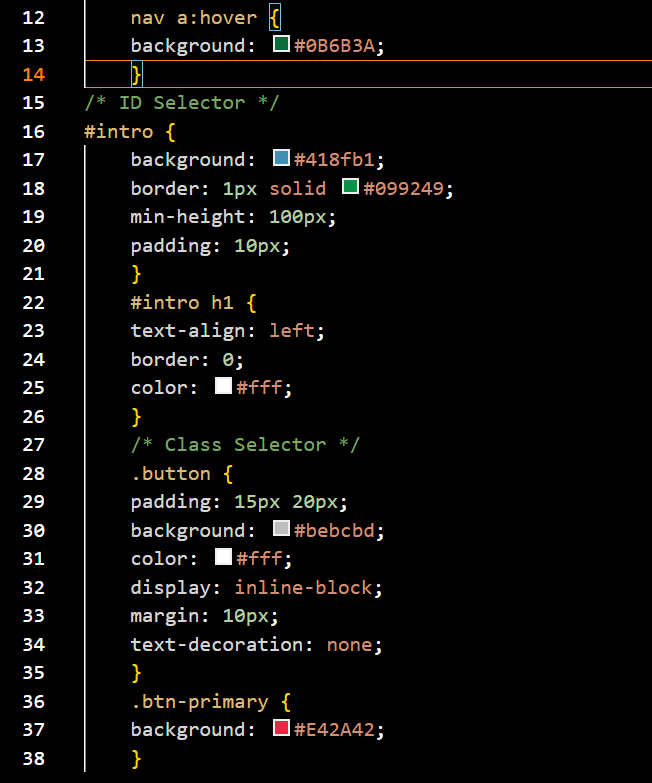
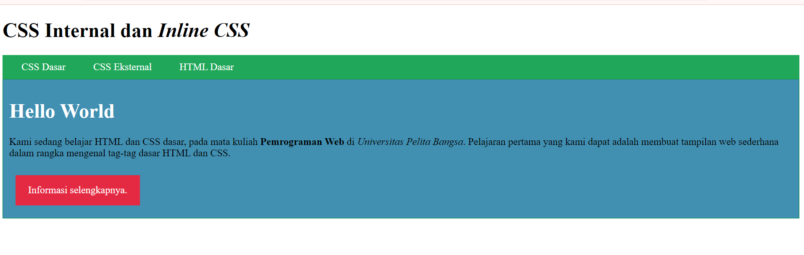

# lab2web
# Nama : AZZAHRA NABIILA
# Nim : 312310367
# Kelas : Ti.23.A4
# 1. Membuat dokumen HTML
- CODE

- Result

## 2. Mendeklarasikan CSS
- CODE

- CODE CSS

- Result

## 3. Menambahkan inline CSS
- CODE

- Result

## 4. Membuat CSS Ekternal
- CODE

- Result

## 5. Menambahkan CSS Selector
- CODE

- Result

